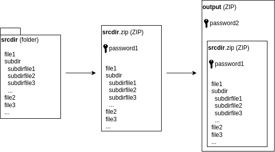
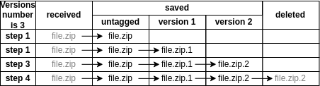

# Distributed Backup Service

## Description

Distributed Backup Service provides peer-to-peer WebRTC file transferring with further backupping. Transferred files can be archived and then password protected.

_NOTE: TURN communication currenlty is NOT supported._

### Archiving

Data sent by a peer-to-peer connection can be not only a single file but even a bunch of files stored in a source directory. Directory's content is zipped twice and each of two archives has its own password set during the process. Sending a zipped directory is enabled by using the `--zipdir` CLI option (see: [CLI options](#cli-options)). The first-level (inner) archive contains all files and subdirectories copied from a source directory recursively. The first level archive has the name of a source directory with the `.zip` extension and has its own first-level password.

The second-level (outer) archive contains the first-level archive only and has a custom name. The second-level archive has its own second-level password in its turn (see: [Encryption mode](#encryption-mode)).



### Versioning

The order of received files' storage follows the specific rules. There is a value that defines maximum amount of versions of files with the same name at the same time (see: [CLI options](#cli-options)). When another file is received, it is saved with an original name but other files with the same name are tagged with a number. The older the file, the greater the number appended to a filename as extension. If amount of versions reaches maximum, the oldest file is deleted and other ones have their tags incremented (shifted).

Let's say we have a file named `file.zip` in a file system and the number of versions is 2. When we receive a new file with the same name, the older file that we already have in the file system becomes `file.zip.1`, and the new file that we received is saved as `file.zip`. When we receive another one, `file.zip.1` is deleted, the `file.zip` becomes `file.zip.1`, and another file that we received the second time is saved as `file.zip`.



### Backup mode

The backup mode is the normal mode which assumes files archiving, transferring and backupping. It should use results of ecnryption mode (see: [Encryption mode](#encryption-mode)) execution to protect archives with passwords (see: [Examples](#examples)).

### Encryption mode

The encryption mode generates a file with encrypted passwords for archives protection (see: [Examples](#examples)) using AES-CBC. This file is then used by the backup mode that decrypts these passwords. The encryption mode is enabled with the `--encrypt` CLI option (see: [CLI options](#cli-options)).

_NOTE: Encryption data such as key and IV (initialization vector) are hardcoded in the `internal/app.go` file. You should replace those values with your own ones before you build the application yourself._

## Signaling

The service currently uses a public file sharing service of [FILE.io](https://www.file.io/) for signaling before a peer-to-peer connection is established. See: [FILE.io REST API](https://www.file.io/developers/).

## Prepare for run

Before running instances to share files, you must generate an API key in FILE.io service (see: [Signaling](#signaling)). To do this, you need to:

1. [Sign up](https://www.file.io/signup)
2. [Log in](https://www.file.io/login) if needed
3. Go to [Account settings](https://www.file.io/account/profile)
4. Go to [API Keys section](https://www.file.io/account/apikeys)
5. Create New API Key.

## Run

### CLI options

```
$ ./distributed-backup -h
Usage of ./distributed-backup:
  -a, --apikey string      FILE.io API key for signaling (see: https://www.file.io/)
  -d, --dstdir string      Destination directory where to store files received from another peer
  -e, --encrypt            Run in the encryption mode to generate a persistent file with encrypted passwords (--password1, --password2) for further archiving in the backup mode
  -o, --outfile string     Output filename zipping a source directory that will be sent as a result
  -p, --passfile string    Path to a file where encrypted passwords are saved to or taken from (see: --encrypt)
  -1, --password1 string   First-level (inner) zip password
  -2, --password2 string   Second-level (outer) zip password
  -s, --srcentry string    Source file/directory that is required to be sent to another peer
  -S, --stun strings       List of used STUN servers (default [stun.l.google.com:19302])
  -u, --uuid string        Common UUID (session ID) for a pair of candidates that are expected to establish a peer-to-peer connection
  -v, --versions uint16    Number of backup versions of received files with the same name (default 1)
  -z, --zipdir             Zip directory that is required to be sent to another peer
pflag: help requested
```

### Examples

To make a connection between peers possible, they must have the same FILE.io API key (see: [Prepare for run](#prepare-for-run)), and the same UUID that can be generated by any online service and must be unique for each pair of peers.

It is also recommended to generate a file that stores encrypted passwords using the encryption mode of the service. The file must be generated at least once before the very first use of the service in the backup mode and is actual until the encryption mode is run next time.

#### Encryption mode's run command

```
$ ./distributed-backup -e -p=/path/to/passwords.txt -1=qwerty -2=asdfgh
```

The command will start the encryption mode that will create a file by the `/path/to/passwords.txt` path where the encrypted `qwerty` and `asdfgh` passwords will be stored. If the command is executed successfully, no output is provided.

#### Receiver's run command

```
$ ./distributed-backup -a=TZEBHA7.ZFD42EP-QSF41WR-QNFGB8R-A9G2V7E -u=91c04021-045a-40ad-a4b0-0596cd604d8e -d=/path/to/dst/dir -v=3
```

The command will start the backup mode that will receive a file from another peer to save it into the `/path/to/dst/dir` directory keeping at most two tagged older versions of files with the same name. The `TZEBHA7.ZFD42EP-QSF41WR-QNFGB8R-A9G2V7E` API key and the `91c04021-045a-40ad-a4b0-0596cd604d8e` UUID will be used for signaling.

#### Sender's run command (single file)

```
$ ./distributed-backup -a=TZEBHA7.ZFD42EP-QSF41WR-QNFGB8R-A9G2V7E -u=91c04021-045a-40ad-a4b0-0596cd604d8e -s=/path/to/src/file.txt
```

The command will start the backup mode that will send the `/path/to/src/file.txt` file to another peer. The `TZEBHA7.ZFD42EP-QSF41WR-QNFGB8R-A9G2V7E` API key and the `91c04021-045a-40ad-a4b0-0596cd604d8e` uuid will be used for signaling.

#### Sender's run command (zipped derectory)

```
$ ./distributed-backup -a=TZEBHA7.ZFD42EP-QSF41WR-QNFGB8R-A9G2V7E -u=91c04021-045a-40ad-a4b0-0596cd604d8e -z -s=/path/to/src/dir -o=output.zip -p=/path/to/passwords.txt
```

The command will start the backup mode that will archive the `/path/to/src/dir` directory's content twice using passwords stored in the `/path/to/passwords.txt` file and will send an output archive file named `output.zip` to another peer. The `TZEBHA7.ZFD42EP-QSF41WR-QNFGB8R-A9G2V7E` API key and the `91c04021-045a-40ad-a4b0-0596cd604d8e` uuid will be used for signaling.

_NOTE: If you use the -z option, a source entry (-s) is supposed to be a directory and an output archive name (-o) is expected to be set._

_NOTE: To make a connection establishment correct, a sender should be run a few seconds later than a receiver due to the current signaling implementation._
